# [Gestor de Biblioteca de Media com Metadados Automatizados]

Com tanta informação digital, seja de assuntos sérios, como trabalhos científicos, reportagens... ou de assuntos menos importantes como livros, filmes (ou suas características), informações de jogos... os utilizadores necessitam cada vez mais de organizar todos estes conteúdos digitais. Apesar disso, não é fácil reunir toda a informação dispersa pela internet, quanto mais organizá-la. Mesmo assim, continua a ser importante a criação de um sistema centralizado para gestão de bibliotecas pessoais. 
Neste contexto, este projeto aborda o desenvolvimento de uma aplicação de gestão de biblioteca de media (filmes e/ou livros). Nesta é possivel adicionar títulos pelo utilizador com enriquecimento automático de dados.

Para este projeto foram escolhidas as APIs externas The Movie Database (TMDB) e Google Books, para organização de filmes e livros, respetivamente. O gestor de biblioteca de media com metadados automatizados utiliza a respetiva API externa, por exemplo a The Movie Database para filmes, para organizar uma biblioteca com os filmes do utilizador, armazenando os metadados ricos desse filme como o título, género, cartaz, sinopse, etc... Isto foi feito através de código backend escrito em Python (linguagem escolhida por nós, mas também podia ser em Java ou outra linguagem de programação adequada), ficheiros Docker, e uma base de dados SQL que é responsável por armazenar os filmes (ou livros) e os seus metadados.

Quando ao frontend, este fornece a parte visual do gestor de biblioteca, a parte que o utilizador realmente vê. Além de mostrar os filmes armazenados numa galeria visual, também é possível utilizar uma ferramenta de pesquisa com função de filtros, para pesquisar por filmes, por exemplo, lançados em uma certa data, ou de um género específico, etc... Esta ferramente de pesquisa com filtros funciona de forma semelhante a uma plataforma de streaming, facilitando ao utilizador encontrar o filme que pretende, ou procurar por filmes dentro de uma certa categoria. Para desenvolver esta galeria visual, utilizaram-se linguagens de programação como HTML (para criar o "corpo" dessa galeria), JavaScript (para programar funções como as de adicionar/remover filmes e de pesquisa com filtros) e CSS (para criar a parte visual).

## Arquitetura


### Arquitetura do projeto

O diagrama a seguir ilustra a arquitetura do projeto:

<p align="center">
  
</p>

Começando pelo **Frontend**, este consiste na interface com a qual o utilizador interage. É nesta camada que o utilizador realiza as ações pretendidas para obter as informações ou funcionalidades disponibilizadas pelo sistema. Estas ações são convertidas em pedidos HTTP, que são posteriormente enviados para o backend.

O **Spring Boot (Controller)** é responsável por receber os pedidos HTTP provenientes do Frontend. Ao receber um pedido, extrai os parâmetros necessários e encaminha a informação para a camada seguinte, denominada **Service Layer**.

Ao chegarmos ao **Service Layer**, encontramos a lógica de negócio da aplicação. É nesta camada que são tomadas decisões como verificar se um filme já existe na base de dados, determinar se deve ser guardado, processar e transformar dados recebidos ou decidir qual a API externa a consultar. Em outras palavras, esta camada coordena e gere o funcionamento interno da aplicação.

De seguida, o fluxo passa para o **JPA Repository**, responsável pelo acesso e gestão dos dados. Esta camada funciona como intermediária entre a lógica de negócio e a base de dados, permitindo guardar, consultar, atualizar e remover informação sem necessidade de escrever consultas SQL manualmente.

Por fim, encontramos o **PostgreSQL**, onde os dados são armazenados de forma permanente. Desta maneira, mesmo após o encerramento ou reinício da aplicação, toda a informação guardada continua disponível para futuras utilizações.

### Arquitetura do repositório

O diagrama seguinte demonstra a esquematização/organização do repositório deste trabalho, sendo que na pasta "assets" encontram-se todas as imagens relativas ao projeto e a pasta "scripts" contém todos os códigos necessários para o funcionamento do projeto. Todas estas pastas estam localizadas numa pasta principal chamada "projeto-02-132807_132909_tema04", que também contém os ficheiros "README.md"  e "LICENSE".

```
detiaveiro/ 
│ 
└── projecto-02-132807_132909_tema04/
    |
    ├── .vscode/
    |    └── settings.json
    │
    ├── assets/
    │    ├── adicao_filme_site.png
    │    ├── adicao_pesquisa_filme_site.png
    │    ├── biblioteca_docs.png
    │    ├── favoritos_site.png
    │    ├── filmes.png
    │    ├── filtro_acao_site.png
    │    ├── filtro_ano_site.png
    │    ├── filtro_favoritos_site.png
    │    ├── filtro_nome_site.png
    │    ├── informacao_filme_site.png
    │    ├── Projeto2.drawio.png
    │    ├── site_inicial.png
    │    ├── sem_filtros_site.png
    |    └── vermaistarde_site.png
    │  
    ├── scripts/
    │   └── biblioteca-digital/
    |        ├──backend/
    │        |   ├── app/
    |        |   |   |
    |        |   │   ├── __init__.py
    |        |   │   ├── main.py              # ponto de entrada FastAPI
    |        |   │   ├── database.py          # ligação à base de dados
    |        |   │   ├── models.py             # modelos SQLAlchemy (tabelas)
    |        |   │   ├── schemas.py            # modelos Pydantic (validação)
    |        |   │   ├── crud.py                # operações na base de dados
    |        |   │   ├── tmdb_client.py         # cliente da API externa TMDB
    |        |   │   ├── routers/
    |        |   │   |   ├── __init__.py
    |        |   │   |   ├── filmes.py
    |        |   │   |   ├── pesquisa.py
    |        |   │   |   └── __pycache__/
    |        |   │   |         └── (...)
    |        |   │   | 
    |        |   |   └── __pycache__/
    |        |   |       └── (...)
    |        |   ├── requirements.txt
    |        |   ├── Dockerfile
    |        |   ├── docker-compose.yml
    |        |   ├── .env
    |        |   └── venv/
    |        |        └── (...)
    |        |  
    |        └── frontend/
    |             ├── index.html
    |             ├── style.css
    |             └── app.js
    │ 
    ├── README.md
    └── LICENSE
```
(Devido ao nosso repositório ser grande, ocultámos alguns ficheiros de pastas geradas automáticamente ao decorrer do trabalho)

## Execução

### Pré-requisitos
* Python 3.9+ (para correr o backend fora do Docker, se necessário);
* Docker e Docker Compose (para correr PostgreSQL e o backend containerizados);
* Conta TMDB (em [themoviedb.org](https://www.themoviedb.org), com chave de API v3);
* HTML, CSS e JavaScript puro (para dar forma e estilo ao frontend do site);

### Configuração e utilização

A lista seguinte mostra cada passo da criação do programa, desde os passos iniciais antes de escrever qualquer código, ao backend, até ao frontend.

1. Começamos por criar uma conta na TMDB, pois é necessário pedir uma chave para termos acesso à sua API externa, que precisamos para desenvolver o programa.
2. Com a API obtida, podemos escrever o código, começando pelo backend. Mais concretamente, o primeiro ficheiro a desenvolver é o docker. É este ficheiro que assegura a ligação entre o gestor de biblioteca e a API externa que contém os metadados dos filmes.
3. Também é necessário o ficheiro requirements.txt, que contém todos os packages que o python vai precisar neste projeto, para que o programa consiga correr.
4. De seguida, escrevemos os ficheiros python. Primeiro, utilizando a package FastAPI, o ficheiro main.py é o ponto de entrada da API externa. Como diz o nome, é o ficheiro principal do programa, que contém código fundamental para que a biblioteca funcione corretamente ao arrancar.
5. O ficheiro database.py faz a ligação à base de dados, utilizando packages relacionados a SQL.
6. O passo anterior só é possível com o ficheiro tmdb_client.py, que é o cliente da API externa TMDB e permite obter os metadados que esta contém.
7. Também com SQL, o ficheiro models.py cria tabelas com cada metadado dos filmes da biblioteca.
8. O ficheiro schemas.py utiliza Pydantic para validar os dados dos filmes.
9. Por último, o ficheiro crud.py é quase tão importante como o main.py. É ele que executa todas as operações dentro da biblioteca, sejam elas adicionar/remover um filme, pesquisar por um filme na base de dados, filtrar os filmes presentes na biblioteca, adicionar/remover um filme da lista de favoritos ou ver mais tarde.
10. Com o backend concluído, podemos começar a desenvolver o frontend, para dar uma cara apresentável a todo este código.
11. Primeiro, escremos o código HTML, presente no ficheiro index.html. É este ficheiro que ajuda a formatar e organizar a apresentação da página web, assim como é responsável por certos elementos como tabelas, botões, menus dropdown ou divisões na página.
12. Mais ou menos de forma simultânea, também desenvolvemos o JavaScript no ficheiro app.js. Este assegura a funcionalidade dos elementos da página, como os botões e os menus dropdown, por exemplo, mas também as funções programadas pelo backend.
13. Por fim, o ficheiro style.css trata da parte visual da página, sendo nele que escolhemos as cores utilizadas, as fontes e os tamanhos de letra do texto, o tamanho dos elementos como botões, tabelas e divisões, entre outros.

### Funcionamento

A lista a seguir explica como utilizar a biblioteca digital e cada passo que o programa gestor da biblioteca faz durante a sua execução.

1. Para que a biblioteca funcione, é preciso começar por executar alguns comandos no terminal. Com o comando ```cd```, ir para scripts/biblioteca-digital/backend.
2. Executar o comando ```docker compose up --build``` e esperar até aparecer a seguinte mensagem:
```
db-1       |  database system is ready to accept connections
backend-1  |  INFO: Application startup complete.
```
3. Se não houver nenhum erro, isto executa o ficheiro Docker e faz com que ele se ligue à base de dados (database.py e main.py).
4. Para verificar que o programa está a responder, abrir no browser o seguinte link: http://127.0.0.1:8000/docs e deve aparecer algo como:

<p align="center">
  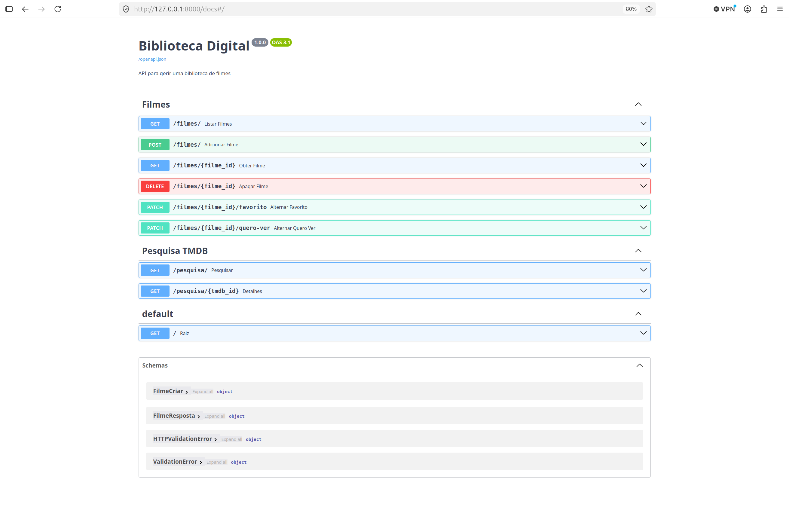
</p>

(acrescentamos aqui também a visualização do link: http://127.0.0.1:8000/filmes/)
<p align="center">
  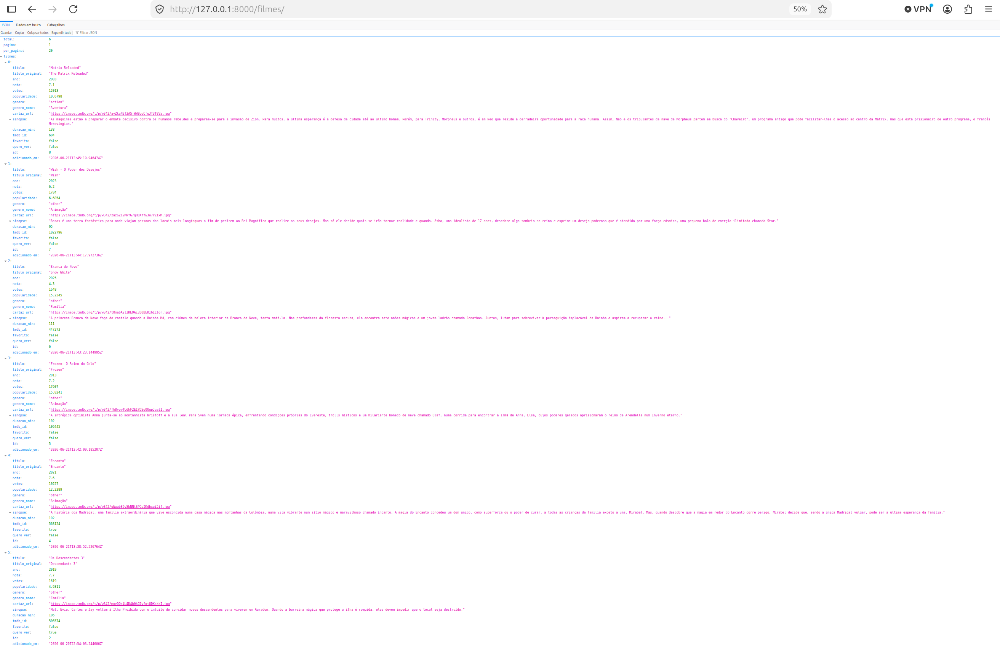
</p>

5. Abrir no browser o ficheiro index.html localizado na pasta scripts/biblioteca-digital/frontend.

<p align="center"> 
  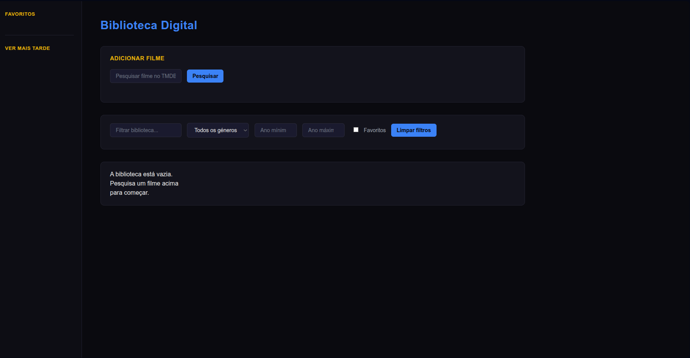 
</p>

7. Quando o utilizador pesquisa por um filme que pretende adicionar, o programa vai buscar as informações necessárias, ou seja, os metadados dos filmes que podem corresponder ao nome que foi pesquisado, à API externa (neste caso, a TMDB) através do ficheiro tmdb_client.py.
  
<p align="center">
  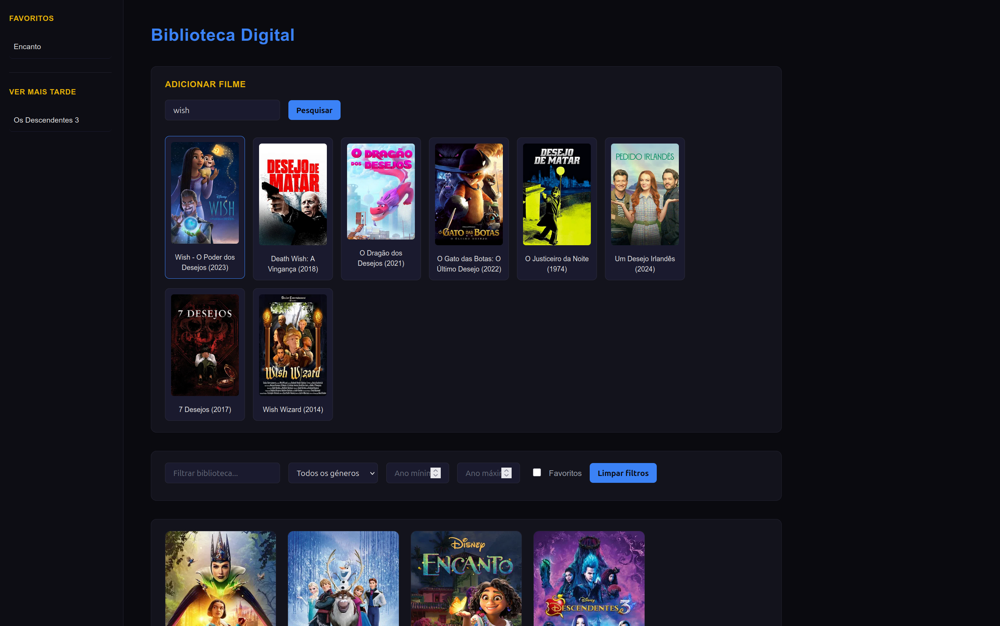
</p>

7. Ao clicar no filme desejado, o ficheiro schemas.py reúne os seus metadados e o filme é adicionado à biblioteca. O programa também adiciona outros dados, como a data em que o filme foi adicionado à biblioteca.

<p align="center">
  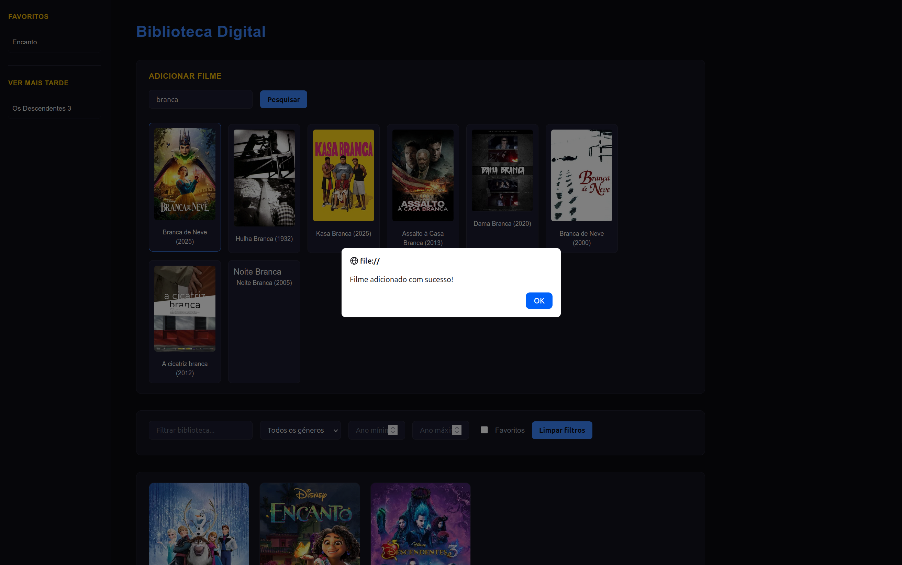
</p>

8. Se o filme já estiver na biblioteca, ou caso o utilizador pretenda remover um filme dela, isto é resolvido através do ficheiro crud.py. No caso do filme já estar na biblioteca, a página web exibe uma mensagem que informe isso ao utilizador.

<p align="center">
  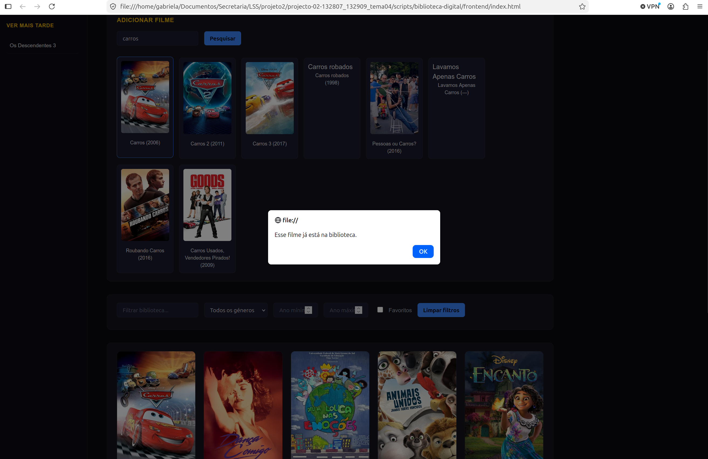
</p>

9. Ainda no crud.py, se o utilizador pretender pesquisar por um filme já presente na biblioteca, pode usar a função de pesquisa.

<p align="center">
  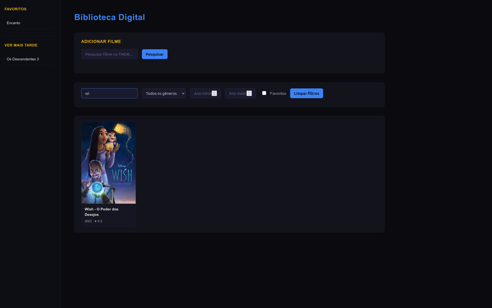
</p>

10. Com as tabelas do ficheiro models.py, o crud.py permite ao utilizador pesquisar por filmes utilizando filtros. Estes filtros incluem título, género, ano de lançamento, data de adição à biblioteca, entre outros.

<p align="center">
  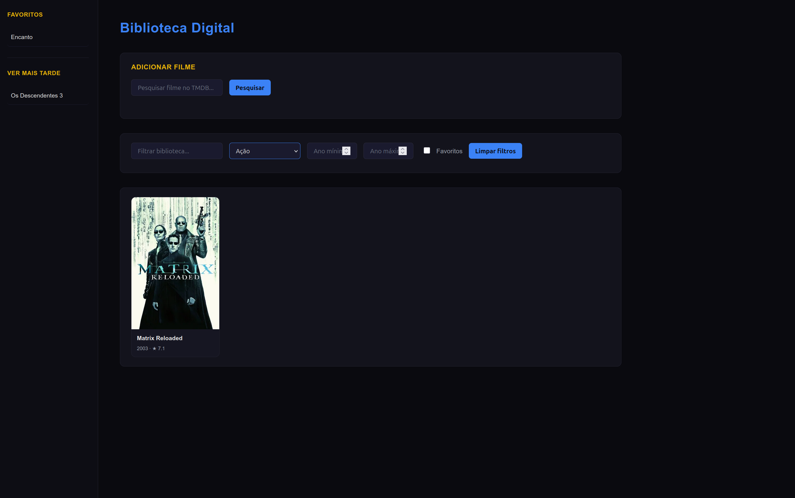
</p>
<p align="center">
  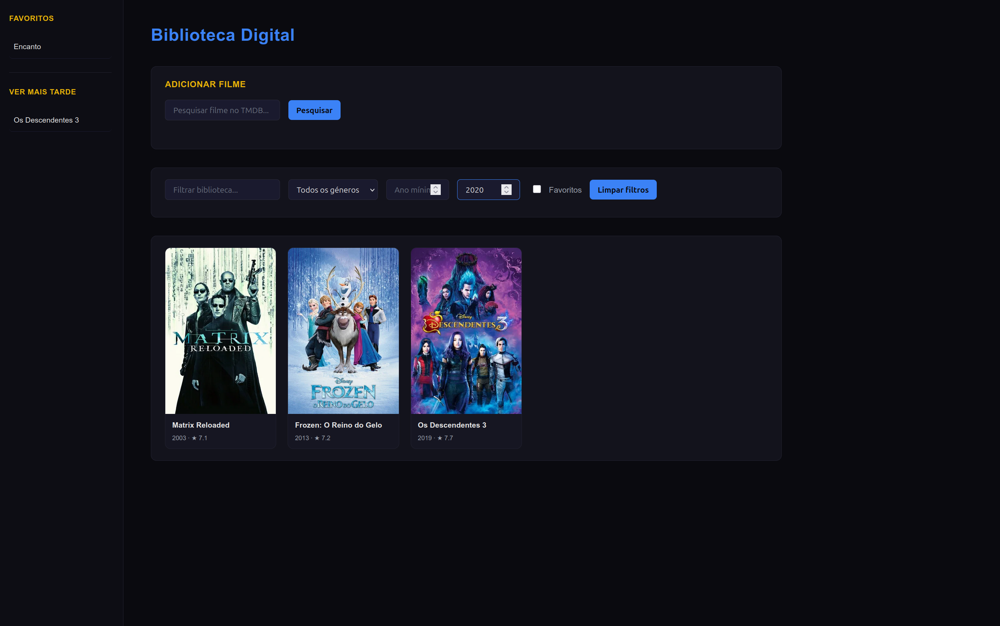
</p>
<p align="center">
  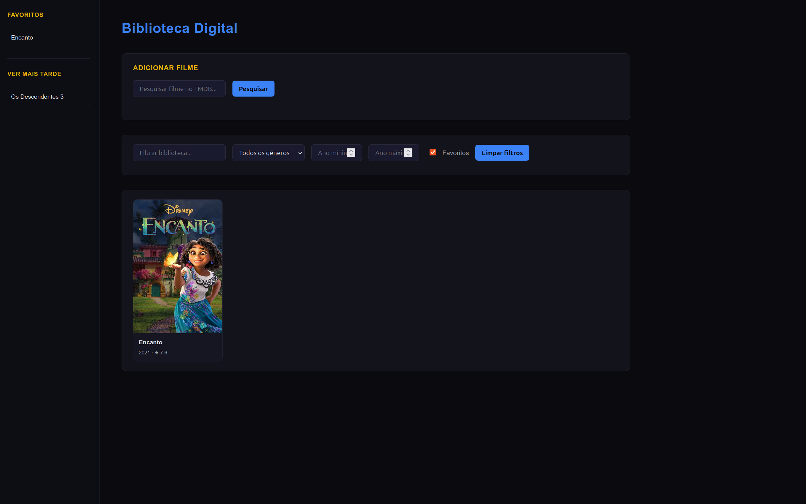
</p>

11. Por fim, quando pretender sair, abrir o terminal e premir as teclas ctrl + C. Isto irá terminar a conexão do docker.

Nota: O comando ```docker compose up --build``` só é necessário na primeira vez. Nas próximas vezes que se utilizar a biblioteca, basta escrever ```docker compose up```, sem a parte "--build".

## Aparência da biblioteca digital
A imagem abaixo mostra um exemplo de como a biblioteca se parece ao abri-la no browser.

<p align="center">
  
</p>

## Algumas funcionalidades extra 

<table align="center">
  <tr>
    <td align="center">
      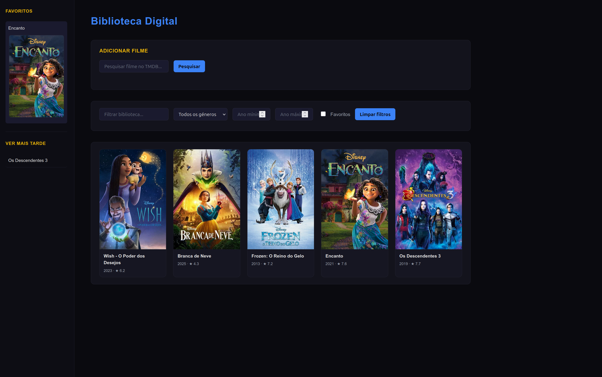<br>
      <sub><b>Lista de filmes favoritos</b></sub>
    </td>
    <td align="center">
      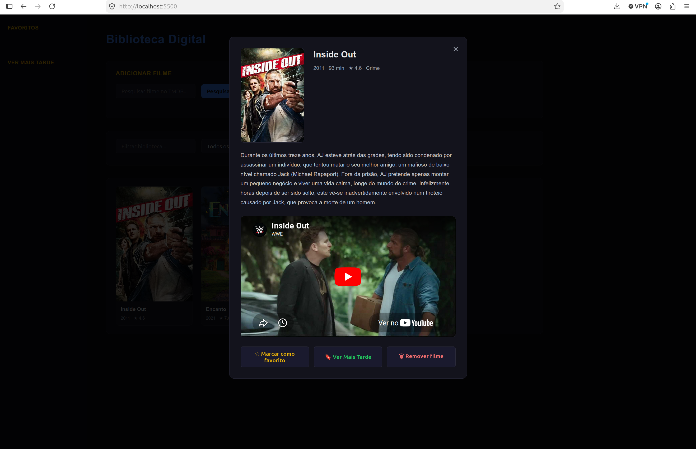<br>
      <sub><b>Informações do filme</b></sub>
    </td>
    <td align="center">
      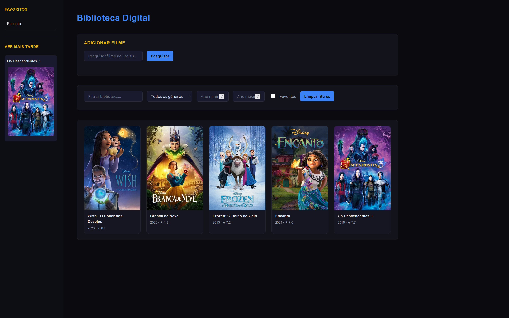<br>
      <sub><b>Ver Mais Tarde / Desejos</b></sub>
    </td>
  </tr>
</table>

## Autores

```markdown
## Autores

* [**Gabriela Fonseca**](https://github.com/gabriela-fonseca)
* [**Ana Teresa**] (https://github.com/AnaTeresa44)
```

## Ajudantes

Prestou apoio na escolha do tema e na definição da abordagem inicial do projeto.

```markdown
## Ajudantes

* [**Francisco Ribeiro**](https://github.com/FranciscoRibeiro03)
```

## Licença

```markdown
## Licença

This project is licensed under the MIT License - see the [LICENSE](LICENSE) file for details.
```
