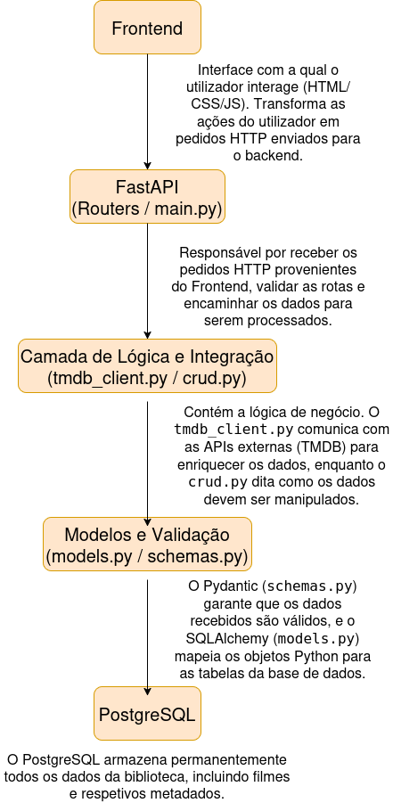

[](https://classroom.github.com/a/xN-SHTD1)
# [Gestor de Biblioteca de Media com Metadados Automatizados]

Cada vez mais, a realização de backups dos ficheiros armazenados nos computadores torna-se essencial. Com a constante evolução tecnológica, torna-se também mais fácil para utilizadores mal-intencionados obterem acesso a informações confidenciais, trabalhos pessoais e outros dados importantes presentes nos sistemas informáticos. Para além do risco de roubo de informação, existe igualmente a possibilidade de eliminação acidental de ficheiros, seja por falhas do sistema ou por erro humano. Neste contexto, torna-se importante a existência de sistemas automáticos que garantam a segurança e preservação dos dados, reduzindo a necessidade de intervenção manual e evitando possíveis esquecimentos na realização de backups.

O projeto “Backup Automatizado para o Nextcloud” consiste no desenvolvimento de um sistema de backup automatizado utilizando Bash scripting. O sistema tem como principal função recolher os ficheiros definidos pelo utilizador e comprimi-los num único ficheiro no formato ".tar.gz". Posteriormente, o backup gerado é armazenado numa pasta sincronizada pelo Nextcloud Desktop Client, executado através do Docker.


Uma vez que esta pasta se encontra monitorizada pelo cliente Nextcloud, sempre que um novo ficheiro é adicionado, este é automaticamente sincronizado com o servidor remoto. Desta forma, o sistema garante simultaneamente um backup local e um backup na cloud, aumentando a segurança e disponibilidade dos dados armazenados.


Além disso, através da utilização do "cron", é possível automatizar completamente a execução do sistema, permitindo que os backups sejam realizados em horários previamente definidos pelo utilizador. Para a implementação deste projeto são utilizadas tecnologias como Docker, Nextcloud, Bash scripting e cron.


## Arquitetura


### Arquitetura do projeto

O diagrama a seguir ilustra como o projeto funciona:

<p align="center">
  
</p>

O diagrama anterior descreve a arquitetura do nosso projeto, começando pelo **Frontend**, que consiste na interface com a qual o utilizador interage. É nesta camada que o utilizador realiza as ações pretendidas para obter as informações ou funcionalidades disponibilizadas pelo sistema. Estas ações são convertidas em pedidos HTTP, que são posteriormente enviados para o backend.

O **Spring Boot (Controller)** é responsável por receber os pedidos HTTP provenientes do Frontend. Ao receber um pedido, extrai os parâmetros necessários e encaminha a informação para a camada seguinte, denominada **Service Layer**.

Ao chegarmos ao **Service Layer**, encontramos a lógica de negócio da aplicação. É nesta camada que são tomadas decisões como verificar se um filme já existe na base de dados, determinar se deve ser guardado, processar e transformar dados recebidos ou decidir qual a API externa a consultar. Em outras palavras, esta camada coordena e gere o funcionamento interno da aplicação.

De seguida, o fluxo passa para o **JPA Repository**, responsável pelo acesso e gestão dos dados. Esta camada funciona como intermediária entre a lógica de negócio e a base de dados, permitindo guardar, consultar, atualizar e remover informação sem necessidade de escrever consultas SQL manualmente.

Por fim, encontramos o **PostgreSQL**, onde os dados são armazenados de forma permanente. Desta maneira, mesmo após o encerramento ou reinício da aplicação, toda a informação guardada continua disponível para futuras utilizações.

### Arquitetura do repositório

O diagrama seguinte demostra a esquematização/organização do repositório deste trabalho, sendo que na pasta "assents" encontram-se todas as imagens relativas a este projeto e na pasta "scripts" temos todos os códigos necessários para o funcionamento do projeto. Todas estas pastas estam localizadas numa outra chamada "projeto-02-132807_132909_tema04", que também contem os ficheiros "README.md"  e "LICENSE".

``
detiaveiro/ <br/>
│ <br/>
└── projecto-02-132807_132909_tema04/ <br/>
    │ <br/>
    ├── assets/ <br/>
    │   └── Projeto2.drawio.png <br/>
    │ <br/>
    ├── scripts/ <br/>
    │   └── -.sh <br/>
    │ <br/>
    ├── README.md <br/>
    └── LICENSE <br/>
```

## Configuração e execução

Criação do servidor Nextcloud:
- ir ao sait do nextcloud (https://nextcloud.com/);
- seleciona a onde diz "download" e escolher a opção "Nextcloud server";
- selecionar a onde diz "comunity projects";
- escolher a opção "get docker image";
- anda paar baixo até encontrar "Base version - apache", a onde deve estar um código docker;
- copie esse código, coloque-o num ficheiro no seu computador;
- após isso, onde diz "MYSQL_ROOT_PASSWORD=" ;"MYSQL_PASSWORD=" e "MYSQL_PASSWORD=" coloque á frente, "nextcloud";
- de seguida guarde o ficheiro;
- abra o terminal, na pasta onde guardou o ficheiro;
- execute o seguinte comando : docker compose up;
- entrar em localhost:8080 e seguir a configuração do nextcloud

parte do backup:
- instala o cliente nextcloud, executando os seguintes códigos:
sudo apt update
sudo apt install nextcloud-desktop -y
- abre o nextcloud, escrevendo no terminal "nextcloud";
- ao abrir o nextcloud client, prime login;
- introduz o URL do servidor que esta no ficheiro docker, que é "http://localhost:8080";
- seguir os passos que aparecem de seguida;
- coloca no browser o mesmo URL;
- autoriza o cliente;
- seleciona a pasta de ficheiros que se encontra no canto superior esquerdo, da página;
- agora, passamos ao cron. Voltando ao terminal e executa o comando:
crontab -e
- Acrescenta no fim a seguinte linha de texto:
* * * * * bash  /home/gabriela/Documentos/Secretaria/LSS/projeto1/projecto-01-132807_132909_tema03/scripts/bash_gabi.sh
- colocar o horario em que se pretende que os backups sejam feitos em "* * * * *".
(visitar o sait https://crontab.guru/#*_*_*_*_* para ajuda)

### Pré-requisitos
* Docker;
* NextCloud ( servidor pessoal ou outro );
* Bash;
* cron;
* Linux environment (Ubuntu/Debian recomendado);


### Execução
1. Step one (e.g., clone the repository)
2. Step two (e.g., install dependencies)
3. Step three (e.g., command to run the application)

## Autores

```markdown
## Autores

* [**Gabriela Fonseca**](https://github.com/gabriela-fonseca)
* [**Ana Teresa**] (https://github.com/AnaTeresa44)
```

## Ajudantes

Prestou apoio na escolha do tema e na definição da abordagem inicial do projeto.

```markdown
## Ajudantes

* [**Francisco Ribeiro**](https://github.com/FranciscoRibeiro03)
```

## Licença

```markdown
## Licença

This project is licensed under the MIT License - see the [LICENSE](LICENSE) file for details.
```
